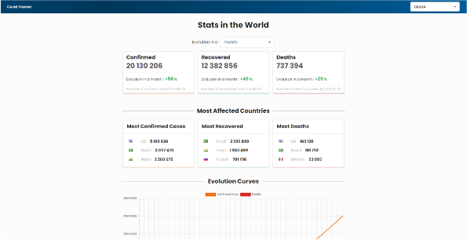

# Covid-19 Tracker

## What's this ?
Web application built with React for Covid-19 data visualization

## Content
* Global stats of confirmed, recovered and deaths case of Covid-19 virus in the World or for each countries
* Evolution percentage of confirmed, recovered and deaths case of Covid-19 virus in the World or for each countries (weekly or monthly)
* Display of the 3 Most Affected Countries (confirmed, recovered and deaths)
* Evolution curve since the appearance of the Covid-19 virus

## Main Stacks
| Stacks    |            |          |         |                                                     |                                                                         |
|:---------:|:----------:|:--------:|:-------:|:---------------------------------------------------:|:-----------------------------------------------------------------------:|
| **Front** | React.js   | Redux    | Webpack | [react-semantic-ui](https://react.semantic-ui.com/) |[react-chartjs-2](https://github.com/jerairrest/react-chartjs-2)         |

> #### Data is provided by great [covid-19-api](https://github.com/mathdroid/covid-19-api)

## Roadmap

🚀 &nbsp;**OPEN** &nbsp;&nbsp;📉 &nbsp;&nbsp;**1 / 5** goals completed **(20%)** &nbsp;&nbsp;📅 &nbsp;&nbsp;**Aug 14 2020**

| Status | Goal | Labels | Repository |
| :---: | :--- | --- | --- |
| ✔  | Publish projet v1         | `done`        | [master](https://github.com/MkDs17/CovidTracker/tree/master) |
| ❌ | Add Yeasterday Component  | `in progress` |                                                              |
| ❌ | Format numbers in Charts  | `todo`        |                                                              |
| ❌ | Improve Charts design     | `todo`        |                                                              |
| ❌ | Create map Component      | `todo`        |                                                              |

---------------- 

You can reach me on GitHub or on [StackOverflow](https://stackoverflow.com/users/13077371/mkds17)

Peace ! 
